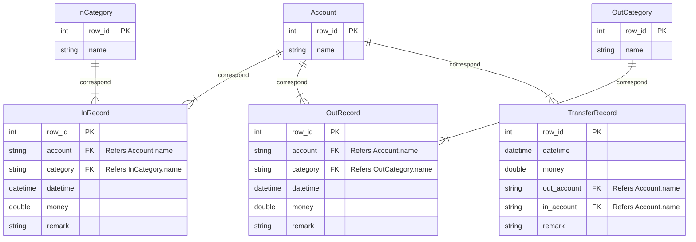

# Entity

-   `Account`: Your accounts for use.
-   `InCategory`: Categories of income.
-   `OutCategory`: Categories of outcome.
-   `InRecord`: Record your income.
-   `OutRecord`: Record your outcome.
-   `TransferRecord`: Transfer record, which means transferring from one account to another.

---

# E-R Diagram

---

# Constraints

-   `InRecord`:
    -   `money`: should be greater than 0.
-   `OutRecord`:
    -   `money`: should be greater than 0.
-   `TransferRecord`:
    -   `money`:  should be greater than 0.
    -   `out_account` can't equal with `in_account` (In a transfer record, inflow and outflow in the same account is meaningless).

---

