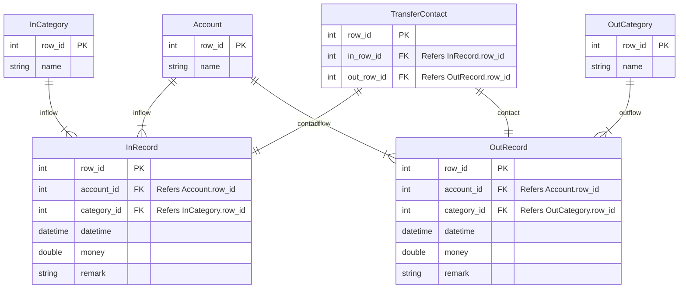

# Entities

-   `Account`: Your accounts for use.
-   `InCategory`: Categories of income.
-   `OutCategory`: Categories of outcome.
-   `InRecord`: Record your income.
-   `OutRecord`: Record your outcome.
-   `TransferContact`: When transferring from one account to another, a row in `InRecord` and a row in `OutRecord` will be tied together.

---

# E-R Diagram

# Database Diagram

>   Generated by Jetbrains^®^ DataGrip.

---

# Constraints

-   `InRecord`:
    -   `money`: should be greater than 0.
-   `OutRecord`:
    -   `money`: should be greater than 0.

---

